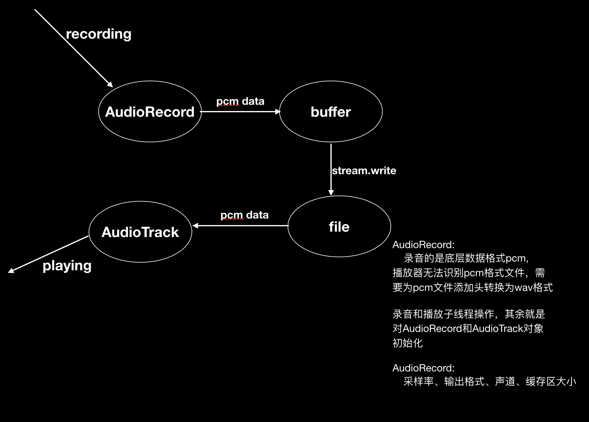

# AudioRecord音频开发

AudioRecord是Android提供的录音功能的一个类，经过它录音的数据时原始音频数据pcm，除此之外有一个MediaRecord，它录音的数据是压缩、编码后的数据，前者适合底层直接对底层数据操作的场景，经过AudioRecord录音的数据文件，其他播放器无法进行播放，需要用为文件添加header头才可以

## AudioRecord使用步骤

前提要你设定一个缓冲区Buffer，Audio将每次录音数据放到buffer，我们在把buffer的数据读出来，通过流保存到文件

1. 实例化AudioRecord
2. 设定缓存区Buffer大小
3. 开始录音-子线程
4. 创建流输出到file
5. 关闭数据流
5. 停止录音，释放内存

## 框架图

